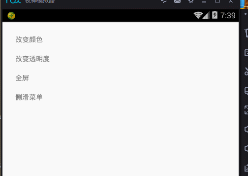

# Android-StatusBarColor
android 沉浸式状态栏的实现，超级简单

# 使用方法

## 1、  android studio 添加依赖库

  compile 'com.jaeger.statusbaruitl:library:1.0.0'
  
  ------------------------------------------------
  
  
## 2、  代码中使用
 
     //设置颜色
     StatusBarUtil.setColor(Activity1.this, Color.BLUE );
         
     //设置透明度，0- 255
     StatusBarUtil.setTranslucent( Activity2.this , 127 ) ;
         
     //设置全屏
     StatusBarUtil.setTransparent(  Activity3.this ) ;
        
     //侧边菜单
     mDrawerLayout = (DrawerLayout) findViewById( R.id.drawer_layout );
     mDrawerLayout.setDrawerShadow(R.mipmap.ic_launcher , GravityCompat.START);
     StatusBarUtil.setColorForDrawerLayout( Activity4.this  , mDrawerLayout , Color.BLUE) ;
